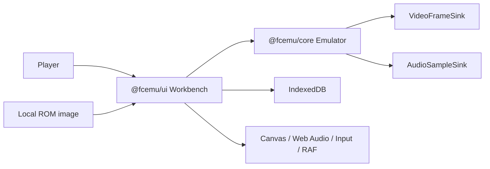

# Architecture

FC Emu is a two-package TypeScript monorepo. Its architecture combines two ideas:

- **hardware-aligned domain modeling** — CPU, PPU, APU, cartridge, controller, DMA and clock state
  belong to the physical component or signal that owns them;
- **clean dependency direction** — domain and application policy do not depend on browser frameworks
  or infrastructure.

This is not an enterprise DDD template applied to an emulator. A folder or class is introduced only
when it protects a hardware invariant, owns a state machine or represents an external boundary.

## System context



The core never opens ROM files or talks to the network. The browser workbench reads an explicitly
selected local file, constructs one core runtime and owns scheduling, focus, audio lifecycle and
persistence.

## Workspace map

```text
packages/
  fc-emu/                         @fcemu/core
    src/domain/
      emulation/
        apu/                      channel timing and modulation state
        clock/                    one regional machine clock
        cpu/                      instruction and interrupt cycle state
        dma/                      OAM/DMC transfers and arbitration
        mapper/                   cartridge board contract and implementations
        bus.ts                    machine composition and signal routing
        memory.ts                 independent CPU and PPU address maps
        ppu.ts                    rendering and PPU register behavior
      model/                      cartridge, memory, frame and ROM identity
    src/application/              public emulation use cases and output ports
    src/index.ts                  supported package API

  ui/                             @fcemu/ui
    src/domain/                   Workbench session and region policy
    src/application/              lifecycle use cases and ports
    src/infrastructure/browser/   core, file, input, audio, video and storage adapters
    src/presentation/             React view
    src/app/compose.ts            browser composition root
```

## Dependency rule

Dependencies point toward policy:

```text
@fcemu/core
  domain <- application <- public package API

@fcemu/ui
  domain <- application <- infrastructure/presentation <- app composition
```

Enforced constraints:

- Core domain code cannot import application, UI, DOM, Canvas, Web Audio, browser `File` or
  IndexedDB APIs.
- UI domain and application code cannot import browser infrastructure or React.
- UI infrastructure imports `@fcemu/core` only through its package root.
- Concrete adapters are constructed only in `packages/ui/src/app/compose.ts`.
- Runtime import cycles are forbidden.

`yarn check:layers` and `yarn check:circular` enforce these rules in the required quality gate.

## Core model

### Cartridge construction

ROM construction is a fail-closed pipeline:

```text
ArrayBuffer
  -> CartridgeHeader parser
  -> supported-format policy
  -> CartridgeMemory allocation
  -> mapper/submapper + board-geometry validation
  -> Mapper construction
  -> Bus power-on
```

Parsing a field does not imply support for its hardware. Malformed images raise
`CartridgeFormatError`; unsupported mapper identities, variants and geometries raise mapper-domain
errors before address calculations begin. The details are in
[Cartridge subsystem](./subsystems/cartridge.md) and [Cartridge formats](./cartridge-formats.md).

### Machine composition

`Bus` is the core composition root. It owns one CPU, PPU, APU, cartridge/mapper, two standard
controllers, the DMA arbiter, internal RAM and `MachineClock`. Devices communicate through explicit
reads/writes and narrow signal ports:

- IRQ producers assert named level-sensitive sources; the CPU observes their logical OR.
- PPU drives a physical `/NMI` level; CPU edge detection samples it at the clock-defined boundary.
- APU requests DMC DMA through a narrow port.
- IRQ-capable mappers depend only on `MapperInterruptPort`, not the complete bus.
- CPU and PPU memory are separate decoders because they are separate physical buses.

`Bus.update()` advances one CPU cycle. `Bus.updateFrame()` repeats the same engine until the PPU
crosses a frame boundary. There is no frame-level CPU shortcut or second instruction interpreter.

### Time authority

`MachineClock` is the only owner of committed CPU time, projected bus time, synchronized APU time
and fractional CPU-to-PPU phase. `ConsoleTiming` supplies immutable NTSC/PAL/Dendy constants.

This separation prevents:

- per-instruction rounding drift in PAL's 16:5 CPU:PPU ratio;
- independent APU/PPU watermarks disagreeing about a CPU access;
- interrupt sampling being inferred from an instruction's returned cycle count;
- mapper IRQs depending on presentation frames or synthetic scanline callbacks.

See [Clock and timing](./subsystems/clock-and-timing.md).

### Mapper boundary

The mapper module is one cohesive cartridge-hardware submodule:

- `Mapper` defines CPU/PPU read/write, CPU and PPU data-line drive masks, optional CPU expansion
  decode, pattern/nametable CIRAM routing or cartridge-driven nametables, lifecycle and save-state
  capabilities.
- Optional observations describe real pins/events: CPU R/W cycle, PPU address line, completed PPU
  read and per-dot timing.
- `createMapper` is the single mapper/submapper/board-selection boundary.
- Each implementation owns only the registers, RAM window, mirroring, bus-conflict and IRQ behavior
  of one board family.

PPU address-sensitive and read-triggered behavior are deliberately different. MMC3 observes the
normalized address before transfer to filter A12; MMC2/MMC4 commit a CHR latch only after the
triggering byte has been selected. Mapper 95 and TxSROM route CIRAM A10 from a CHR output through the
same boundary instead of mutating a global mirroring mode; Namco 163 can route individual pattern
pages into CIRAM; Sunsoft-4 can replace CIRAM reads with CHR ROM entirely. Detailed contracts live
in [Mapper reference](./mappers/README.md).

### Internal extraction rule

Keep state in its physical owner unless extraction creates a meaningful boundary. Existing examples:

- `CpuMemoryCycle`, `CpuReadModifyWriteCycle`, `CpuBranchCycle`, `CpuStackCycle`,
  `CpuControlFlowCycle` and `CpuInterruptEntry` own distinct externally visible bus sequences.
- `SpriteEvaluator` owns primary-to-secondary OAM selection and overflow state.
- `DmcDma` and `SpriteDma` own independent transfers coordinated by `DmaArbiter`.
- `PpuIoBusLatch` owns the CPU-facing dynamic PPU bus, including per-bit decay.

Pure address/identity calculations remain functions. Field-only wrappers, duplicated booleans and
objects without an independent lifecycle should not be introduced for naming symmetry.

## UI model

The UI package owns the Workbench, not emulation hardware.

### Domain

`EmulationSession` is an immutable state machine for idle/loading/ready/running/paused/error,
audio-permission state, selected region, frame/cycle counters and quick-save availability.
`ExecutionRegion` owns the `auto`/NTSC/PAL/Dendy preference rules.

### Application

`EmulatorApplication` orchestrates:

- latest-wins ROM loading;
- play, pause, reset, power cycle and eject;
- frame-debt scheduling;
- controller intent;
- battery checkpoints;
- three quick-save slots;
- runtime rebuild on region change;
- observable diagnostics.

It depends only on ports. The active ROM image and runtime form one private lifecycle record so an
asynchronous load, persistence operation or region rebuild cannot install half of a session.

### Infrastructure and presentation

Browser adapters implement file reading, the core anti-corruption layer, animation-frame
scheduling, Canvas output, AudioWorklet buffering, keyboard/gamepad input and IndexedDB storage.
React renders application snapshots and dispatches use cases; it does not own emulator state.

## State and persistence

Three state categories have different owners and compatibility rules:

| State               | Owner          | Compatibility                                             | Storage                             |
| ------------------- | -------------- | --------------------------------------------------------- | ----------------------------------- |
| Battery NVRAM       | Cartridge/core | Exact persistent-memory layout                            | UI `SaveRamStoragePort` / IndexedDB |
| Emulator save state | Core           | Exact schema version + ROM identity + region + audio rate | Opaque to UI runtime port           |
| Quick save          | UI application | Outer format + ROM identity + region + slot               | `QuickSaveStoragePort` / IndexedDB  |

The core save-state envelope is version 15. This revision adds mapper-owned volatile/NVRAM regions
needed by Namco 163's shared 128-byte chip RAM. Every executing aggregate exposes a typed snapshot
with runtime validation. `Bus.restoreState()` is transactional: a nested failure rolls the entire
machine back to the pre-restore snapshot.

Controller buttons currently held by physical input devices are UI intent, not historical machine
state. The Workbench reapplies them after restoring or rebuilding a runtime.

## Error boundaries

- ROM/header errors are deterministic domain failures shown to the user.
- Unsupported hardware fails during cartridge/mapper construction, never as silent approximation.
- Corrupt or obsolete persisted browser records are discarded without preventing a ROM from booting.
- Audio autoplay denial is a recoverable UI state; emulation may continue silently.
- Programming invariant failures remain exceptions and should fail tests rather than being converted
  into generic user errors deep in the domain.

## Verification architecture

Tests mirror ownership:

- pure chip/value tests beside domain code;
- aggregate tests for bus order and cross-device signals;
- application tests with in-memory ports;
- browser-adapter tests with controlled platform doubles;
- checksum-pinned external conformance runners;
- explicit local real-ROM smoke profiles.

Evidence policy and commands are documented in [Testing and conformance](./testing.md).

## Change placement guide

| Change                                                   | Owning location       |
| -------------------------------------------------------- | --------------------- |
| CPU/PPU/APU/mapper behavior                              | Core domain           |
| Run one frame, expose diagnostics, core output ports     | Core application      |
| Session lifecycle, region choice, quick-save policy      | UI domain/application |
| Canvas, AudioWorklet, files, IndexedDB, keyboard/gamepad | UI infrastructure     |
| React layout, accessible controls and status rendering   | UI presentation       |
| Concrete browser object graph                            | UI `app/compose.ts`   |

When placement is unclear, ask which physical component or policy owns the invariant and which
dependencies it must remain independent from. Do not create a shared abstraction until two real
consumers need the same stable contract.
